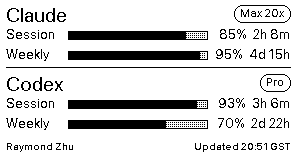

# dot-ai-usage

Turn a [Dot.](https://dot.mindreset.tech) e-ink device into a live dashboard for your **Claude Code** and **Codex** usage.



Every 10 minutes your Mac quietly updates the screen with:

- **Session** — how much of your 5-hour usage window is left, and when it resets
- **Weekly** — how much of your 7-day window is left, and when that resets
- A tag showing your plan (`Max 20x`, `Pro`, etc.)

Runs in the background. No menu-bar icon, no app window, no recurring cost.

---

## Before you start

You need four things. Skip any you already have.

1. **A Mac** — this runs on macOS only.
2. **A Dot. device** — ordered from [dot.mindreset.tech](https://dot.mindreset.tech). After pairing it with the Dot. app on your phone, open the app and add an **"Image API"** content block to the device. Without this the Dot. server rejects the uploads.
3. **Your Dot. API key and device serial.** Both come from the Dot. mobile app: Settings → Developer. Write them down — you'll paste them in later.
4. **Two small tools installed on your Mac:**

   - **[uv](https://github.com/astral-sh/uv)** — runs the Python script so you don't have to install Python yourself. Install with [Homebrew](https://brew.sh):
     ```sh
     brew install uv
     ```
     If you don't have Homebrew, install it first with the one-liner on [brew.sh](https://brew.sh).

   - **[OpenUsage](https://www.openusage.ai/)** — a free macOS menu-bar app that reads your live Claude Code and Codex usage. Download the latest `.dmg` from [its GitHub releases page](https://github.com/robinebers/openusage/releases/latest), drag it into Applications, and open it. In its settings, turn on **"Launch at Login"** and sign in with the same accounts you use for Claude Code and Codex.

---

## Install

Open Terminal and paste these lines, one at a time:

```sh
# 1. grab the project
git clone https://github.com/rayzhux/dot-ai-usage.git ~/dot-ai-usage
cd ~/dot-ai-usage

# 2. make your settings file
cp .env.example .env

# 3. edit your settings file — paste your API key, device serial, and name
open -e .env
```

A text editor will open. Fill in the three values between the quotes:

```
DOT_DEVICE_ID="paste your device serial here"
DOT_API_KEY="paste your api key here"
DOT_OWNER_NAME="Your Name"
```

Save and close the file, then back in Terminal:

```sh
# 4. turn it on
./install.sh
```

You should see `✔ installed sh.rayzhux.dot-ai-usage` and, a few seconds later, your Dot. device should refresh with the usage bars.

**That's it.** It will keep updating every 10 minutes, including after you restart your Mac.

---

## Changing your settings later

Edit the `.env` file again, then re-run the installer:

```sh
cd ~/dot-ai-usage
open -e .env        # edit
./install.sh        # apply
```

## Turning it off

```sh
cd ~/dot-ai-usage
./uninstall.sh
```

This stops the automatic updates. Your `.env` and the folder stay put — reinstall anytime with `./install.sh`.

---

## Troubleshooting

**The device shows `--` everywhere.** OpenUsage isn't running. Open OpenUsage from your Applications folder and make sure "Launch at Login" is on. Wait 10 minutes or run `./install.sh` again to force an immediate refresh.

**The device shows a tiny black dot before your name in the footer.** That means the usage numbers are more than 15 minutes old — OpenUsage probably stalled. Quit and reopen it.

**Nothing happens after `./install.sh`.** Look at the log:
```sh
tail -20 ~/Library/Logs/dot-ai-usage.log
```
If you see `404 NOT_FOUND`, you haven't added the Image API content block to your device in the Dot. app yet (see step 2 in "Before you start"). If you see `401`, your API key is wrong — fix it in `.env` and re-run `./install.sh`.

**You want a different timezone on the footer.** Edit `.env`, set `DOT_TZ="Europe/London"` (or any [IANA zone name](https://en.wikipedia.org/wiki/List_of_tz_database_time_zones)), and re-run `./install.sh`. If you want a friendly abbreviation like `EST` instead of `-05`, also set `DOT_TZ_ABBR="EST"`.

---

## For developers

The whole thing is one Python file (`dot_eink.py`, ~430 lines, stdlib + Pillow). It fetches JSON from [OpenUsage](https://www.openusage.ai/)'s local HTTP API (`localhost:6736/v1/usage`), renders a 296×152 1-bit PNG, and POSTs it to the [Dot. Image API](https://dot.mindreset.tech/docs/service/open/image_api). Scheduling is a plain launchd agent at 600-second intervals.

Try a dry run (no upload, writes `preview.png`):
```sh
uv run --script dot_eink.py --dry-run
```

Pull requests welcome.

---

MIT © Raymond Zhu — see [LICENSE](./LICENSE).
